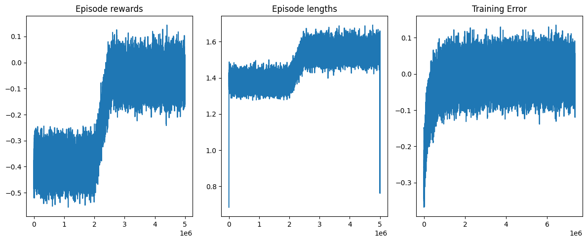
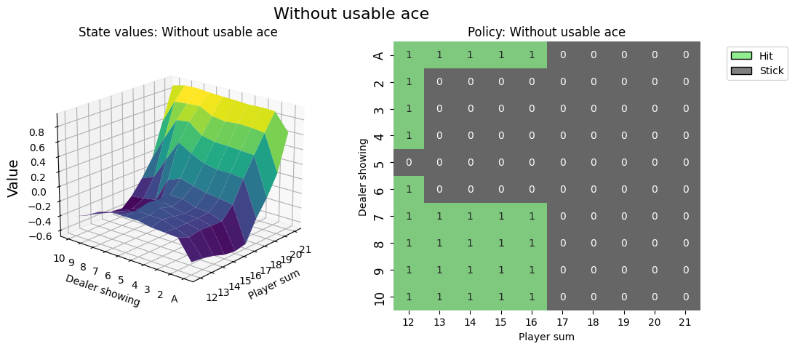
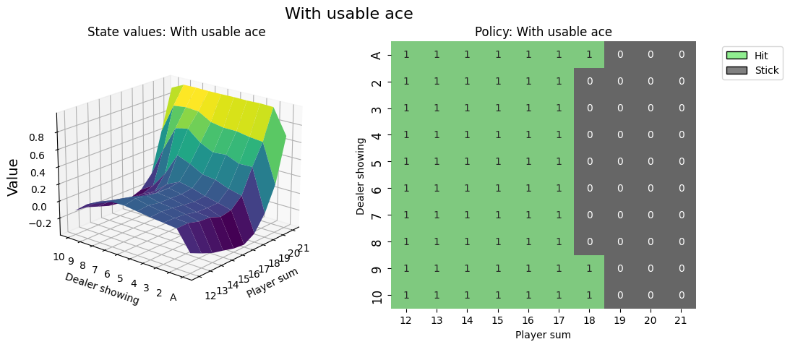

# F23_Blackjack_AI
*Ryan Karch (karchr), Dominic Beyer (beyerd), Angelica Loshak (loshaka), Michael Dong (dongm2)*

## Running Instructions
### Before running any code please perform the following:
- Ensure that you have at least python 3.10 installed
- Run the following command from the top level directory:\
  `pip install -r requirements.txt`
### Final Product
To run the final product follow these steps:
- Pull the most recent changes from main
- Run main.py exactly as is
  - main.py takes a single command line argument: the port to host the website on
  - If no argument is given, the website will be hosted on port 8000.
  - We have noticed some issues with the uvicorn library and it is best to use the default port of 8000.
- Visit http://127.0.0.1:8000 (or whichever port you have specified)
- When opening the site you will be prompted to connect your Sepolia MetaMask account.
- On the login screen you can enter your name, check your balance and transfer Wei in and out of your blackjack account
- This page allows you to change the smartness level of the provided AI agent
- You may also take this time to upload a custom agent to play alongside you (specifications for this will be detailed below).
- Once you have at least 10 Wei in your account and have set your name you can click proceed to advance into the game itself
- The game shows you playing in the middle, our agent playing on the right, and your uploaded agent (if you have one) on the left
- To begin you must increase your bet and lock it in with the bet button
- Then, hit the deal button to begin the game
- Once your cards are dealt you can hit until you either bust or decide to stand
- The AI(s) and Dealer will then play
- The results of your game will be displayed on the screen, and you will be prompted to sign a MetaMask transaction to save your new balance to the smart contract
- To play another round, simply begin to bet again
  - Please note that you will not be allowed to proceed until your transaction has been completed
- To cashout your winnings, refresh the page or return to the login page and use the withdraw functionality
### Development Testing
- Blockchain code:
  - The [contract](https://sepolia.etherscan.io/address/0x8288b1e33c9035efbd037ebcc3f6a5a34afe49e8) is hosted on RemixIDE
  - The [most up to date code](https://github.com/AI-and-Blockchain/F23_Blackjack_AI/blob/main/blockchain/BlackjackBettingContract.sol) is saved in the blockchain directory
  - This directory also contains the contract address in [address.txt](https://github.com/AI-and-Blockchain/F23_Blackjack_AI/blob/main/blockchain/address.txt)
  - Using these two files, once can connect to the smart contract in Remix and directly interact with it
  - This folder also includes a pdf of [tests that we ran](https://github.com/AI-and-Blockchain/F23_Blackjack_AI/blob/main/blockchain/ContractTestDocument.pdf)
- All code (frontend and backend) must be run through main.py, test.py or a similar .py file from the top level directory.
  - test.py contains two starter functions for individual testing:
    - game_test() will simulate a frontend server in a terminal environment that allows the tester to view states of the game as it progresses
    - web_test() will launch the website in its current development state
      - Please note that at this point in our development, this is identical to the Final Product function

### Uploading your own custom agent
- For the baseline agent please refer to our [custom agent template](https://github.com/AI-and-Blockchain/F23_Blackjack_AI/blob/main/model/CustomAgentExample.py)
- When the game begins, the agent will be dealt two cards through two calls of `add_card`, where it will be given an integer representation of the card (1-13), and its current hand total.
- At this time, it will also be given the dealer's face up card through `add_dealer_card`, where the card input is the same representation 1-13.
- The agent will then be asked to make a decision of standing or hitting through `decision` This function should only return "S" or "H", for stand and hit respectively.
  - This function will only be called when a decision is required; it will never be called after the agent has already stood or busted.
- If decision is "H", `add_card` will be invoked again to give the agent its hit card
- The final required function is `start_new`, which indicates to the agent that a new round will be started, and it should prepare accordingly.
- The agent code is passed through a round of verification before it can be used on the site. This includes testing returns of functions, as well as ensuring that they do not fail.
- It is imperative that the constructor only takes an id field, and assigns this value to `self.id` without manipulating the string. Any changes to this will cause the program to fail verification.
- At the current time this verification does not protect agains a user's agent taking a long time to decide, whether this is a biproduct of the design or a malicious action, and this would be a feature to add in the future.

### Component Diagram

### Sequence Diagram

### AI Algorithms/Models

We will be using Q-learning as our algorithm.

#### Why Use Q-learning, and How Does it Work?

* Q-learning is a reinforcement-learning algorithm where a model can learn and improve its strategy over time.
* When the model makes a decision based on the current state of the environment, the Q-table is updated, and this affects the model's future decisions.
* The Q-table stores an action for each possible state of the environment - when a state is encountered, the corresponding action for that state is retrieved from the Q-table and executed, and its value is updated. The model chooses the action that provides the highest "reward".
* We can train the model, and then use its Q-table in our code, or we can train the model over time while it plays on our system.

#### Results of Q-learning Training

The open-source model we used for development included some functionality for plotting the strategy of the generated model. We can see how the strategy improved over time. The error curve flattened, and the rewards were maximized. We trained the model on many, many games so it would create the best strategy possible, at the cost of our graphs being very condensed. However, the trends in the data are still apparent.

The graphs below show the strategy that the AI model learned. We can observe that without a usable ace, the model learned to be conservative, because, due to the game parameters, it knew that the dealer would stand on 17. With a usable ace, however, the model learned that it was not at risk of busting (going over 21), so it was not as conservative. Note that our terminology differs from the graph slightly; the term "stick" is equivalent to our use of the term "stand", which both indicate that the user will not elect to receive another card at that point.

### Blockchain Architecture
* Smart contract used for betting cryptocurrency against the Blackjack AI
    * Ensures that the outcomes of the betting are fair and secure
    * Enables trust between customer and the gambling service because blockchain is immutable
* Logic programmed using **Remix IDE** in **Solidity**
    * **SepoliaETH** used by users to make bets and receive payments
    * **MetaMask** Ethereum wallet is used to deploy smart contract 
* Users connect to smart contract through MetaMask
    * [web3.py](https://web3py.readthedocs.io/en/stable/) Python Library used to interact with the smart contract
    * Users will be prompted to login into their MetaMask wallet account
    * Smart contract will verify and send transactions between users using their Ethereum address
